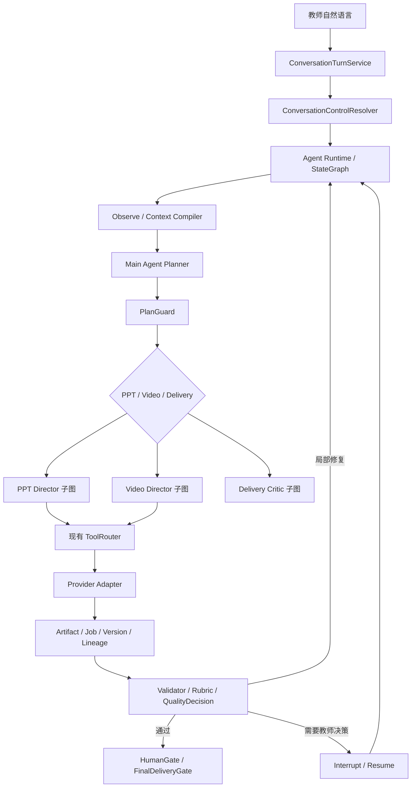

# 候选接入边界与迁移风险

## 1. 边界原则

最重要的不是“选哪个框架”，而是防止框架侵入业务事实层。

建议采用：

```text
框架负责怎么运行
ShanHaiEdu 负责运行什么、什么算完成、什么可以交付
```

## 2. 候选目标结构



Graph State 只保存业务对象引用，例如 `artifactId`、`version`、`hash`、`jobId`、`status` 和 `locator`。PPTX、视频、逐页设计稿和完整血缘继续存放在 ShanHaiEdu 的业务系统中。

## 3. 替换与保留映射

| 当前能力 | 候选处理 |
|---|---|
| 自研通用 Tool Loop | 由选定框架 Runner / StateGraph 替换 |
| AgentHarness 循环控制 | 由图执行和条件边替换 |
| 通用 Checkpoint / Resume | 由框架 Checkpointer 或 RunState 承担 |
| HumanGate 暂停点 | 映射为框架 Interrupt，但业务批准记录仍落自有数据库 |
| PPT / Video Director | 作为专业子图或 Agent-as-Tool |
| ConversationTurnService | 保留为应用入口，逐步减负 |
| ConversationControlResolver | 保留，输出结构化 ControlIntent / ChangeRequest |
| ToolRegistry / ToolRouter | 保留；框架 Tool 只调用 ToolRouter |
| Provider Adapter | 保留，禁止专业子智能体绕过 Router 直接提交 Provider |
| Artifact / Job / WorkflowNode | 保留为业务事实源 |
| ProjectExecutionLease | 保留，框架 Checkpoint 不等于跨进程互斥 |
| Contract / Validator / Rubric | 保留为确定性业务门禁 |
| FinalDeliveryGate | 保留，框架不知道真实交付资格 |

## 4. 自然语言打断的完整语义

框架 Interrupt 只能解决“运行停在哪里”，不能自动解决“业务上哪些结果作废”。完整链路仍应是：

```text
教师提出修改
-> ConversationControlResolver 识别 ChangeRequest
-> 当前 Run 请求 drain / abort
-> Provider 可取消则取消
-> Provider 不可取消则给在途结果加隔离标记
-> ChangeSet Agent 形成结构化变更
-> ImpactResolver 计算受影响 Artifact
-> 创建新版本，上游变更，下游标 stale
-> 从 Replan 节点恢复
```

例如在“样张选择计划”阶段要求修改叙事大纲，不能简单跳回大纲节点；必须记录新大纲版本，并使样张计划、逐页设计稿和后续 PPT 生成结果失效或待复核。

## 5. 主要迁移风险

### 5.1 双事实源

如果 Graph State 保存完整 Artifact，而业务数据库也保存 Artifact，恢复后可能出现两个不同版本。必须明确业务数据库是唯一事实源，图状态只保存引用和运行控制状态。

### 5.2 副作用重复

Checkpoint 恢复通常从节点或步骤边界重放。Provider 提交、文件写入和批准动作必须使用稳定 `inputHash`、`providerTaskId`、幂等键和提交记录。

### 5.3 图版本不兼容

在途 Run 可能跨越代码升级。每个持久运行至少保存：

- `runtimeFramework`
- `runtimeVersion`
- `agentGraphVersion`
- `stateSchemaVersion`
- `promptVersion`
- `contractVersion`

### 5.4 嵌套框架

LangGraph、OpenAI Agents SDK、Vercel ToolLoopAgent 都能管理循环。如果同时让两层拥有规划和重试权，会出现重复调用、预算失控和难以解释的 Trace。第一阶段必须只有一个运行编排权威源。

### 5.5 追踪数据泄露

框架 Tracing 可能记录教材摘录、教师指令、工具参数和 Provider 输出。正式接入前必须定义脱敏、采样、保留时间和关闭敏感内容记录的策略。

### 5.6 框架不能提高交付质量本身

框架只能使节点运行、返修和恢复更可靠。PPT 和视频效果仍取决于：

- 设计大纲与叙事质量。
- PageSpec / ShotSpec 完整度。
- Skills、Prompts、Contracts 和 Rubrics。
- 样张与样片 Gate。
- Critic 发现质量及局部返修策略。

## 6. 建议 Spike，而不是直接迁移

建议选择一个完全隔离的流程片段：

```text
PPT 叙事大纲
-> 两套样张计划
-> 教师选择或修改
-> 单页样张生成
-> Critic
-> 局部返修
-> 审批后结束
```

Spike 必须验证：

1. 教师能在样张阶段自然语言回跳修改叙事大纲。
2. 单页质量失败只返修受影响页面，不重跑全部任务。
3. 人工暂停数小时后可从持久状态恢复。
4. Provider 已提交但进程中断时不会重复提交。
5. 继续复用当前 ToolRouter、Artifact、Job、PlanGuard 和质量门。
6. UI 能收到稳定的节点、Tool、审批和恢复事件。
7. 旧框架版本或图版本的在途 Run 有明确处置策略。

## 7. 进入正式迁移的门槛

只有同时满足以下条件，候选 ADR 才能从 `Proposed` 变为 `Accepted`：

- Spike 七项验证全部通过。
- 明确唯一运行编排权威源。
- 明确业务数据库与框架状态的边界。
- 有可回退到现有 Runtime Adapter 的开关。
- 有 Provider 幂等和隔离测试。
- 有持久恢复和版本升级测试。
- 有成本、延迟和 Trace 隐私评估。
