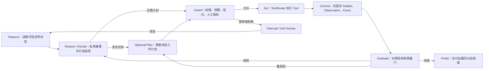

# A+ 总体工作流设计：受控 ReAct 智能体

修订日期：2026-07-11
修订原因：原方案把顶层过程表达成固定状态机，容易把智能体退化为单向工作流。本版明确采用受控 ReAct，并把确定性流程收缩到工具内部的 Workflow Capsule。

## 1. 产品目标

让教师面对一个能理解目标、主动规划、选择工具、观察结果、局部返工并解释状态的主智能体，而不是面对一条只能顺序点击的生产线。

同时，智能体的自主性不能覆盖以下系统真值：权限、预算、教材证据、教师授权、真实文件、质量门和最终交付状态。

一句话原则：

```text
Agent 决定下一步尝试什么；系统决定刚才真实发生了什么。
```

## 2. 顶层循环



ReAct 的核心不是保存模型的原始思维链，而是让每次真实工具结果都回到模型，触发下一次判断。系统只持久化简短决策摘要、行动意图、工具结果、计划变化和完成证据。

## 3. 自主性与控制权分配

| 决策 | 主 Agent | 系统 | 教师 |
|---|---|---|---|
| 理解目标、追问、拆解任务 | 主责 | 提供可信上下文 | 补充真实约束 |
| 选择 Tool、顺序、分支、并行与返工范围 | 主责 | 动态限制可用 Tool | 可改道 |
| 是否创建或修改 Working Plan | 主责 | 校验计划边界 | 可确认高成本方案 |
| 权限、预算、幂等、并发锁 | 不得覆盖 | 主责 | 高风险时授权 |
| 文件是否真实、Artifact 是否已批准 | 不得宣称 | 主责 | 审阅内容 |
| 教学效果、视觉效果是否达标 | 提出评价与修复 | 执行硬门并保存证据 | 最终课堂判断 |
| 是否完成最终交付 | 可提出 finish | 只有审计通过才接受 | 最终批准 |

这套分工不会约束模型“能做什么”，而是只约束模型“不能伪造什么、不能越权做什么”。

## 4. 架构分层

```text
Teacher Conversation
  -> Main Agent Runner
     -> Observe ContextPackage / AgentWorldState / ToolObservations
     -> Decide / optional Working Plan / native tool calls
     -> PreTool Guard + Human Interrupt
     -> ToolRouter
        -> Internal Capability Adapter
        -> Provider Adapter
        -> MCP Adapter
        -> Deterministic Workflow Capsule
     -> PostTool Truth / Quality Guard
     -> Commit Artifact + Observation + AgentEvent + Checkpoint
     -> Reflect / Replan / Ask / Finish
```

### 4.1 Main Agent Runner

负责真正的多轮行动循环，而不是只让模型返回一个 `toolPlan`。同一轮教师请求内可以经历多次 Tool Call、Observation 和 Replan，直到：

- 目标完成；
- 需要教师输入或授权；
- 达到预算、轮次或重复失败上限；
- 发生不可恢复的策略阻断。

### 4.2 Working Plan

Working Plan 是可选、可修改的工作记忆，不是固定 DAG：

- 简单问答或单工具任务可以没有 Plan。
- 多步交付才创建 Plan。
- 模型可以新增、删除、重排、并行或替换步骤。
- 系统只校验步骤是否合法，不替模型决定创作路径。
- `WorkflowNode` 继续表示教师可见里程碑，不等同于 Agent 的每个内部动作。

### 4.3 Guard 与 Interrupt

Guard 必须位于 ToolRouter 前后：

- 调用前：输入 schema、项目归属、已批准上游、权限、预算、幂等键、并发锁、HumanGate。
- 调用后：文件真实性、结构校验、质量结果、产物归属、敏感信息、完成声明。

需要教师确认时保存检查点并结束当前执行，不挂住一个长期模型请求。恢复时从持久状态继续。

### 4.4 ToolRouter

继续作为唯一真实执行入口。模型和专家 Agent 都只能提交 ActionIntent，不能直接访问 Provider、文件、数据库或 MCP Server。

### 4.5 Workflow Capsule

只有确定性、可预测、适合代码执行的生产过程才封装成 Capsule Tool，例如：

- PPTX 结构校验、渲染和逐页证据采集。
- 图片尺寸、哈希和解码检查。
- 视频流规格统一、FFmpeg 时间轴合成、完整解码和音频统计。
- 真实文件盘点、manifest 生成、ZIP 打包与反向核验。

Capsule 内部可以有顺序、并行和循环，但它只是一个受控 Tool，不是顶层 Agent 的固定路线。

## 5. 智能体与 Tool 的关系

### 5.1 单一主智能体

教师始终只和 Main Agent 对话。Main Agent 负责上下文、解释、工具选择、改道和最终汇总。

### 5.2 专家作为 Tool

PPT Director、PPT Critic、Video Director、Video Critic 优先采用 agents-as-tools：

- 主 Agent 调用专家并接收结构化结果。
- 专家只获得完成子任务所需的最小上下文。
- 主 Agent 保留教师会话和最终控制权。
- 只有确实需要专家直接接管教师对话时才使用 handoff。

### 5.3 不做 Contract 与 Tool 一一对应

Contract 是规则和验收边界；Tool 是一个有价值的动作。二者不是同一层：

- 一个 Tool 可以消费多个 Contract，并在内部执行确定性 Capsule。
- 一个 Contract 可以同时约束生成 Tool、审查 Tool 和返工 Tool。
- 模型每轮只看到当前状态真正可用的少量高层 Tool，不一次暴露所有底层 API。

## 6. PPT 在受控 ReAct 中如何工作

推荐 Tool 组合：

```text
inspect_project_state
build_or_query_evidence
design_ppt_as_agent
review_ppt_spec_as_agent
generate_visual_asset
build_and_render_pptx_capsule
review_rendered_ppt_as_agent
repair_ppt_component
```

典型循环：

```text
Observe 教材、目标、已批准教案
-> Agent 判断是否先补证据或直接设计 Deck Narrative
-> 调用 PPT Director
-> Observe PageSpec 和风险
-> 需要时让教师选风格，或直接规划页面资产
-> 对独立页面/资产安全并行生成
-> 每个真实资产回传 Observation
-> Critic 只定位失败 page_id / asset_id
-> Agent 选择重生素材、改布局、修数学层或保留原页
-> PPTX Capsule 生成并渲染真实文件
-> 渲染审查回传结果
-> 只返工失败组件
-> 所有硬门通过后完成 PPT
```

不可绕过的门只有：教材和数学真值、批准的页面规格、真实文件、逐页渲染审查和最终交付审计。叙事、风格、素材策略、工具次序和返工方式由 Agent 动态决定。

## 7. 视频在受控 ReAct 中如何工作

推荐 Tool 组合：

```text
inspect_project_state
build_course_anchor
design_video_concepts_as_agent
select_or_confirm_concept
author_shot_specs_as_agent
build_asset_bible
generate_video_shot
review_video_shot_as_agent
assemble_video_timeline_capsule
review_final_video_as_agent
repair_video_component
```

典型循环：

```text
Observe 教案边界和课程锚点
-> Agent 判断需要候选、追问还是直接展开已选创意
-> 生成并锁定独立视频创意
-> 形成 ShotSpec 与 Asset Bible
-> 对互不依赖的镜头安全并行生成
-> 每个片段先完整解码和镜头审查
-> Agent 根据 Observation 只重做失败镜头、字幕或音轨
-> Timeline Capsule 用媒体语义合成，不做 MP4 字节拼接
-> 成片审查回传时间段级 Finding
-> Agent 重排修复动作或请求教师判断
-> 课程锚点、效果门和技术门通过后完成视频
```

PPT 与视频只共享教材事实、教学目标、课程锚点和必要品牌约束，不共享同一创意脚本。

## 8. 并行与停止规则

允许安全并行：

- 独立 PPT 页面素材。
- Asset Bible 锁定后的独立视频镜头。
- 不同 Rubric 维度的只读审查。

必须串行：

- 同一 Artifact 的写入和批准。
- 同一页面或镜头的多个互斥版本提交。
- 视频时间轴组装、最终包和最终审计。

停止条件：

- `finish` 必须携带可核验的交付证据引用。
- 达到最大 Tool Turn、成本或时长预算时保存 Checkpoint 并暂停。
- 同一工具、同一输入摘要、同一失败原因连续两次时禁止原样重试。
- Tool 失败默认形成 Observation 回到 Agent；只有不可恢复策略错误才终止。

## 9. 成功标准

1. Main Agent 在一次教师请求中可以执行多轮 `Tool -> Observation -> Replan`。
2. 非致命 Tool 失败会回到模型，不会直接把整个 Run 判死。
3. Plan 可选且可修改，系统没有固定顶层 DAG。
4. ToolRouter、HumanGate、Artifact Truth 和 Quality Gate 仍不可绕过。
5. PPT 支持 page/asset 级返工；视频支持 shot/audio/caption 级返工。
6. WorkflowNode 只表达教师可见里程碑，不控制 Agent 的每一步。
7. 最终完成声明只能由真实文件、质量结果和交付审计共同支持。
