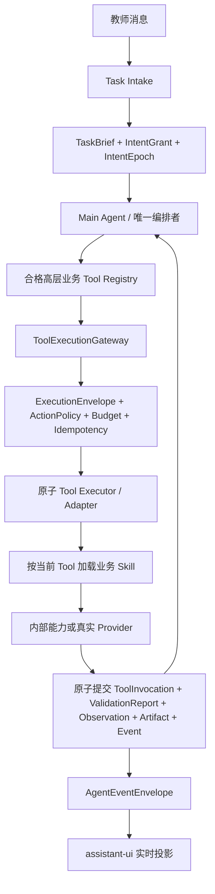

董事长，正确方向是：**不要继续在旧工作流上叠加“智能体能力”，而是把产品重新收敛为一个真正的 Main Agent；原有工作流全部拆成可独立发现、选择、调用、观察和恢复的原子 Tool。**

这次重构不是换一套工作流，也不是把固定 DAG 改成更复杂的 DAG。核心变化只有一句话：

> **Main Agent 负责思考和编排，Tool 负责完成一个有明确输入、输出和副作用边界的动作，服务端负责安全与真值，前端负责实时投影。**

## 一、为什么现在会越来越乱

当前系统不是单一架构，而是多套历史设计叠在一起：

1. **旧宏节点工作流**
   - `WorkflowNode`、固定阶段、节点完成状态和 approve 后自动推进，默认任务会按既定链路向下走。
   - 它适合早期演示，但会把“教师想做什么”转换成“系统下一节点是什么”。

2. **服务端 Capability / toolPlan 编排**
   - Capability Planner、`toolPlan`、`deliveryPlan`、宏节点配置会提前决定调用范围和下一步。
   - Main Agent 即使能调用 Tool，也只能在服务端预设的候选和顺序中活动。

3. **Main Agent 原生 function-call / ReAct**
   - 模型已经具备根据 TaskBrief 选择 Tool、读取 Observation、继续、修复和 Replan 的骨架。
   - 但它和外层计划器同时存在，形成两个编排者。

4. **Adapter、Director、Critic 内含流程责任**
   - 部分 Adapter 不只执行，还会解释任务、补默认目标、决定重试或推动下一阶段。
   - Director/Critic 容易从“提供审查结果”演变为机械必经节点。

5. **Artifact 审批驱动流程**
   - approve、旧 M2 自动推进、节点状态和最终包现场拼装，仍把 Artifact 当作流程按钮，而不是版本化事实。

6. **前端固定阶段投影**
   - UI 使用固定五阶段、宏节点最终状态或从消息正文猜状态。
   - 后端即使发生了多轮 Tool、Observation 和局部返修，教师看到的仍是一张大任务卡和一个迟到的最终结果。

这些设计各自都曾解决过一个阶段的问题，但叠加后会产生四个直接后果：

- Main Agent 名义上是智能体，实际上没有完整控制权。
- 服务端资格过滤、默认语义和固定输出合同会替模型缩小用户目标。
- 失败后系统倾向机械重试、`ask_teacher` 或跳下一节点，而不是让 Main Agent读取具体 Observation 后重新判断。
- 前端无法实时展示智能体正在做什么、为什么失败、产生了什么以及从哪里恢复。

## 二、V1.0 目标架构



### 1. Main Agent 是唯一编排者

只有 Main Agent 拥有以下权力：

- 选择当前调用哪个业务 Tool；
- 决定 Tool 调用顺序；
- 读取成功或失败 Observation；
- 决定 continue、repair、换 Tool、Replan、暂停或停止；
- 根据教师的新消息更新目标和排除项；
- 决定局部返修哪个页面、镜头或版本。

以下组件都不得拥有第二编排权：

- Capability Planner；
- `toolPlan` / `deliveryPlan` 递归执行器；
- Runner；
- Adapter；
- Skill；
- Director / Critic；
- assistant-ui；
- Artifact approve 路由；
- 外部 Codex。

### 2. 工作流不再是控制器

原有工作流中的业务知识可以保留，但必须拆成三类资产：

- **原子 Tool**：执行一个明确动作；
- **业务 Skill**：只增强当前 Tool 的领域质量；
- **质量规则**：校验 Tool 结果能否成为可信 Observation 或 Artifact。

工作流模板最多只能作为 Main Agent 可读取的参考策略或任务示例，不能直接取得执行权，也不能规定固定下一 Tool。

### 3. 服务端只做不能交给模型的事情

服务端保留以下硬责任：

- 身份、用户、项目和任务隔离；
- TaskBrief、IntentGrant、IntentEpoch 和计划版本核验；
- 权限、预算、费用披露和副作用门禁；
- `ExecutionEnvelope` 强制校验；
- 幂等、并发写者、重试预算和 Provider 提交状态；
- 文件真实性、血缘、版本和质量状态；
- Tool 结果原子提交；
- HumanGate 的真实风险阻断；
- 事件持久化、恢复和 UI 投影。

服务端不得做以下事情：

- 根据固定阶段选择下一 Tool；
- 因为“尚未有产物”而隐藏能够创建第一个产物的 Tool；
- 将同一 Tool 连续失败自动转换成 `ask_teacher`；
- 把 Director/Critic 设为机械必经节点；
- 在 approve 后自动生成下一个节点；
- 用 deterministic、placeholder、Markdown fallback 或 degraded 结果补成功态。

### 4. 教师协作暂停不是固定审批流

Main Agent 获得一个模型可见、无业务副作用的控制 Tool：`request_teacher_decision`。只有当多个合理理解会实质改变结果，且 TaskBrief、对话、可信 Artifact 和 Observation 仍不能消除边界时，Main Agent 才自主调用它。服务端不通过年级、关键词、固定节点或 `needs_review` 状态决定是否询问。

该 Tool 创建持久化 `DialogueCheckpoint`，记录当前理解、影响、问题、选项和自由输入能力，随后暂停当前 ReAct。教师用自然语言回答后，同一任务、TaskBrief、IntentEpoch 和 ReAct checkpoint 恢复。它不授予费用、外发、权限或破坏性动作，不能替代 `HumanGate`。

## 三、原子 Tool 的设计标准

每个 Tool 必须是一个业务动作，不是一个完整流程，也不是一个 Provider 裸接口。

### 1. Tool 必须满足

- 一个清晰动词和一个主要结果；
- 输入来自当前 TaskBrief、可信 Artifact、教师选择或前序 Observation；
- 输出有稳定结构和最低真实性合同；
- 明确授权、费用和副作用等级；
- 可生成独立 `ToolInvocation`、`ValidationReport` 和 `Observation`；
- 可在不依赖固定前后节点的情况下被 Main Agent 选择；
- 支持幂等、失败关闭和恢复；
- 不自行调用下一业务 Tool。

### 2. Tool 粒度示例

需求和教学：

- `create_requirement_spec`
- `create_lesson_plan`
- `review_lesson_plan`

PPT：

- `create_ppt_outline`
- `create_ppt_page_design`
- `review_ppt_design`
- `create_ppt_asset_brief`
- `generate_ppt_asset`
- `assemble_editable_pptx`
- `inspect_pptx`
- `review_rendered_slide`

视频：

- `create_video_anchor`
- `create_video_concepts`
- `create_video_script`
- `create_storyboard`
- `create_video_asset_brief`
- `plan_video_segments`
- `generate_video_asset`
- `generate_video_segment`
- `assemble_video_timeline`
- `inspect_video`

交付：

- `create_classroom_run_spec`
- `review_cross_delivery`
- `create_final_package`
- `inspect_final_package`

这些 Tool 不是固定顺序。Main Agent 根据当前任务只选择必要能力。例如“只做视频脚本”可以只调用视频创意、锚点和脚本相关 Tool，不得被系统自动扩张为教案、PPT、图片、成片或整包。

### 3. Director 和 Critic 的定位

Director 与 Critic 仍然可以存在，但必须降级为普通审查 Tool：

- 只有存在对应可信审查目标时才暴露；
- 输入是明确版本的 Artifact 或结构化候选；
- 输出是带 reasonCode、finding 和 repair locator 的 Observation；
- 不选择下一 Tool；
- 不直接批准或返修；
- 不因失败自动进入 HumanGate。

## 四、唯一运行合同

### 1. TaskBrief

TaskBrief 是冻结任务语义真源，至少包含：

- 用户真实目标；
- 请求交付物；
- 主输入消息和任务创建时冻结的可信 Artifact引用；
- 年级、学科、教材和课程语境；
- 约束、排除项和局部范围；
- 强度和质量目标；

预算、授权和调用上限只属于同一TaskAggregate绑定的IntentGrant；当前planId、revision、状态和checkpoint只属于TaskAggregate、SemanticSnapshot与ExecutionEnvelope。动态可信Artifact与Observation引用只进入SemanticSnapshot。不得把这些可变事实复制进TaskBrief并在replan时改写digest。

requestedOutputs和excludedOutputs使用唯一canonical枚举，未知值失败关闭；CapabilityAvailability、Main Agent Tool暴露和ToolRouter共用同一范围策略。不得再由各Tool的硬编码依赖把局部任务改写成“逐页PPT设计稿”、PPT前置或完整材料包。

### 2. ExecutionEnvelope

所有执行型 Tool 必须经过同一网关，并验证：

- actor；
- project；
- task；
- TaskBrief digest；
- IntentEpoch；
- plan revision；
- 强度；
- 授权范围；
- 预算版本；
- action digest；
- idempotency key。

没有有效 Envelope 的调用不能进入 Adapter 或 Provider。

### 3. Observation

Tool 成功或失败后，先形成并持久化具体 Observation。至少包含：

- Tool 和 invocation 身份；
- 输入摘要与绑定版本；
- 成功、失败或不确定状态；
- `reasonCode`；
- 可供 Main Agent 使用的结果摘要；
- 产生的 Artifact 引用；
- 可修复字段、finding 和局部 locator；
- 重试预算和恢复入口；
- Provider 提交状态与真实性证据。

Main Agent 必须读取 Observation 后再决定下一步。失败不能被兼容层折叠为“节点失败”或“请教师确认”。

### 4. AgentEventEnvelope

事件只运输已持久化事实：

- turn accepted；
- plan updated；
- Tool started；
- Tool progress；
- Observation committed；
- Artifact available；
- HumanGate required；
- task paused / redirected / completed；
- recoverable / terminal failure。

事件不能直接提升 Artifact、任务完成态或授权状态。

## 五、暂停、改道和失败恢复

### 1. 控制先提交

教师发出暂停、取消、改道或局部修改时：

1. 先持久化控制意图；
2. 暂停保持taskId、TaskBrief digest和IntentEpoch并原子保存恢复点；取消、实质改道或局部修改才提升IntentEpoch或等价revision；
3. 对发生语义变化的控制使旧Envelope和迟到结果失效；
4. 再允许 Main Agent 继续规划。

有无 pending plan 都必须遵守同一规则。

### 2. 失败处理

同一 Tool 失败后：

1. 原子保存 ValidationReport、Observation 和 reasonCode；
2. Main Agent 判断修输入、换合法 Tool、Replan 或暂停；
3. 只有缺少真实教师选择、授权、预算，或存在外发、权限变化、覆盖删除等真实副作用时进入 HumanGate；
4. 重试预算耗尽时诚实暂停并保存恢复入口；
5. 不循环调用，不自动 `ask_teacher`，不生成 fallback 成果。

### 3. 迟到结果

旧 IntentEpoch、旧计划 revision、旧 TaskBrief digest 或不同 task 的结果只能作为审计事实保存，不能提升为当前 Artifact，也不能改变当前任务状态。

## 六、Artifact 与状态模型

Artifact 不是节点完成按钮，而是不可变、可验证、可引用的业务事实。

每个 Artifact 必须绑定：

- projectId / taskId；
- TaskBrief digest；
- IntentEpoch / plan revision；
- 来源 ToolInvocation；
- 输入 Artifact 版本；
- Provider 或 executor 证据；
- 结构与文件摘要；
- 内部质量状态；
- 下游可用状态；
- 教师签收状态。

局部返修必须产生新页面、镜头或 Artifact 版本，只替换 finding 定位的受影响单元。最终包只能消费正式持久化且版本一致的 package asset，不能在下载路由现场拼装。

## 七、assistant-ui 前端重构

前端不再展示固定五阶段流程，也不只展示某个大节点的最终状态。

### 1. 教师应该实时看到

- Main Agent 正在理解什么；
- 当前计划如何变化；
- 哪个 Tool 开始执行；
- 当前步骤的流式进度；
- 当前步骤为什么执行、依据哪些真实输入、预期形成什么；
- 真实开始时间和持续耗时，不显示模拟百分比；
- Tool 返回了什么 Observation；
- 失败发生在哪个具体步骤；
- reasonCode 对教师意味着什么；
- 哪个 Artifact 已经可查看；
- Main Agent 是继续、修复、换 Tool、Replan 还是暂停；
- 刷新后如何从原位置恢复。

### 2. 消息投影

- 普通自然语言使用真实文本流；
- Tool、Observation、Artifact 和 HumanGate 使用结构化 `MessagePart`；
- 同一 turn 的多个活动形成一条有序时间线；
- Artifact 在产生并通过最低真实性门后立即出现，不等待整个宏任务结束；
- 失败卡明确显示 Tool 名称、阶段、原因和恢复动作；
- 终态 assistant 消息只提交一次；
- 前端不从正文关键词推断状态；
- 同一失败只保留具体步骤和唯一恢复入口；
- 不向教师暴露 schema、provider、node_id、storage、debug、local path、token 或内部推理。

## 八、重构实施顺序

### Phase 0：冻结重构规格

- 将本设计转成活动 ADR、迁移清单和特征测试矩阵；
- 标记旧控制路径的所有入口、写状态位置和消费者；
- 明确哪些能力保留为 Tool、哪些降级为兼容投影、哪些必须删除；
- 建立“只能有一个业务编排者”的静态与运行时断言。

### Phase 1：先写失败特征测试

至少覆盖：

- 明确交付任务首轮可以发现创建第一个产物的合格 Tool；
- 不断言固定 Tool 顺序；
- 服务端不能强制下一 Tool；
- Director/Critic 不是机械必经节点；
- Tool 失败后 Observation 回到 Main Agent；
- 重复失败不自动 `ask_teacher`；
- 暂停、无 pending plan 改道和迟到旧结果隔离；
- 跨用户、跨项目、跨任务隔离；
- approve 不自动推进旧 M2；
- 无正式 package asset 时下载失败关闭；
- 前端按步骤流式投影，不以宏节点最终态代替轨迹。

### Phase 2：统一 TaskBrief 与跨轮语义

- 删除 1–6 年级、默认五年级等封闭式语义提取；
- 小学只能作为默认产品语境，不能成为资格限制；
- 贯通真实 requested outputs、局部范围、排除项和强度；
- 建立跨轮 SemanticSnapshot；
- 所有改道更新 IntentEpoch 或等价 revision。

### Phase 3：建立统一 Tool 合同

- 盘点现有高层业务能力并拆分原子 Tool；
- 统一 ToolDefinition、输入/输出 Schema、风险、费用和副作用；
- 所有执行入口强制经过 ToolExecutionGateway；
- Skill 只在 Main Agent 选定 Tool 后加载；
- Adapter 只转换和执行，不补规划语义。

### Phase 4：收敛为单一编排者

- 选择原生 function-call + Observation + ReAct 作为唯一生产控制循环；
- 取消外层 `toolPlan` / `deliveryPlan` 的选择、重试、下一步和停止权；
- Capability Planner 只允许做展示、静态资格或候选描述，不得执行；
- 每次 Tool 结果先原子提交，再回到同一个 Main Agent；
- 对 Responses Runtime 与 OpenAI Agents SDK 做隔离 A/B，只比较 Runtime 适配，不引入第二控制面。

### Phase 5：控制先提交与原子恢复

- 暂停、取消、改道先落库；
- Provider submission、unknown、retry 和 recovery 全部持久化；
- 旧 epoch 结果禁止提升；
- 重试预算耗尽形成可信暂停和恢复入口；
- 保证同一项目一个有效写者、不同用户完全隔离。

### Phase 6：统一事件与 assistant-ui

- 以 `MessagePart + AgentEventEnvelope` 作为唯一 API / UI 合同；
- 自然语言真实流式输出；
- Tool、Observation、失败和 Artifact 分步实时投影；
- 刷新通过事件游标和有界回放恢复；
- 删除固定五阶段和正文猜测状态的 UI 路径。

### Phase 7：删除旧控制路径

- 删除 approve 后的 `advanceM2AfterApproval` 和 DeterministicRuntime 自动推进；
- 删除 forced-next-tool；
- 删除重复失败默认 `ask_teacher`；
- 删除所有 Tool 的硬编码统一 `requestedOutputs`；
- 删除 Artifact 下载时现场拼包；
- 删除 workflow defaults 对任务范围和下一步的生产控制；
- 删除 deterministic、placeholder 和 degraded 成功路径；
- 保留只读历史证据，但不得再被生产入口引用。

### Phase 8：验收

按以下层级分别验收，不能越级上推：

```text
contract / executor / model orchestration / product E2E / release
```

- contract：Tool、Envelope、Observation、Event、Artifact 和隔离合同；
- executor：原子提交、幂等、失败关闭、暂停改道和恢复；
- model orchestration：Main Agent 自主选择 Tool、动态轨迹、Observation/Replan 和无外部编排介入；
- product E2E：真实桌面对话、步骤流、失败位置、Artifact 和刷新恢复；
- release：真实产物、教师签收、部署和切流另行验收。

## 九、固定验收条件

重构完成必须同时满足：

1. Main Agent 是唯一拥有业务 Tool 选择、下一步、重试和停止权的组件。
2. 明确交付任务首轮合格 Tool 集合不为空，且能创建第一个产物。
3. 所有执行型 Tool 强制经过 ExecutionEnvelope 和统一网关。
4. Tool 结果先原子保存 Observation，再由同一 Main Agent 决策。
5. 暂停、无 pending plan 改道、迟到结果隔离和双用户隔离通过。
6. 不存在 forced-next-tool、重复失败默认 `ask_teacher` 或 approve 自动推进。
7. 工作流知识已经拆成原子 Tool、Skill 和质量规则，不再拥有生产编排权。
8. assistant-ui 能实时展示文本、Tool、Observation、失败位置、Artifact 和恢复状态。
9. 不用 mock、placeholder、deterministic fallback 或 degraded 结果冒充完成。
10. TypeScript、生产构建、受影响测试、控制面扩大回归和桌面真实交互通过；V1 前不跑390px。

## 十、明确非目标

- 不重新设计一套固定 DAG；
- 不把 LangChain、LangGraph、Agents SDK、Skill、Director 或 Critic 变成第二编排者；
- 不让 Main Agent 直接调用裸 Provider；
- 不在这次重构中运行真实图片、视频、PPTX、ZIP 或完整材料包 Provider；
- 不用旧 R5、旧 manifest、旧 runId 或历史 fixture 冒充当前通过；
- 不做与控制面、消息结构和前端投影无关的重构；
- 不 commit、不 push、不部署、不移动历史标签，除非用户另行明确授权。

这次重构的判断标准不是“流程还能不能跑”，而是：**当教师提出任意合法的备课目标时，Main Agent 是否能保留完整语义，自主选择必要的原子 Tool，持续读取 Observation 并调整行动，同时让教师实时看见每一步真实进展、失败位置和可用产物。**
