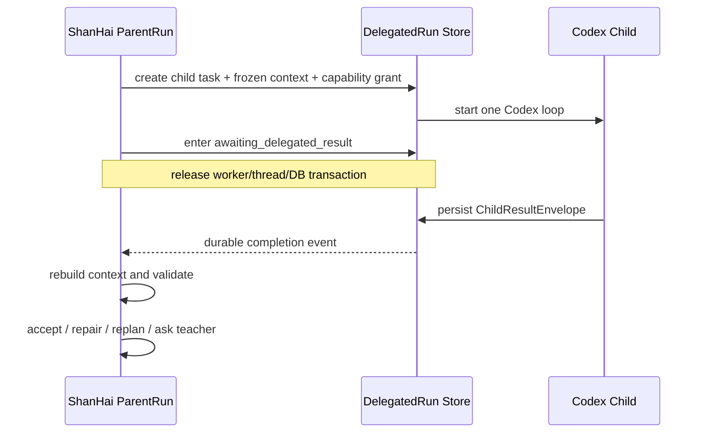

# ShanHai Hermes 与垂类智能体双 Intake 联合开发规划合同

- 合同版本：0.1.0
- 状态：`design_review`
- 模式：`planning_only`
- 适用分支：`intake-hermes`、`intake-vertical-agent`
- 共同研究基线：`main@fd2521f1b558b36f2680a661f9d2eaf34ffa584e`
- 日期：2026-07-15

## 1. 目的与结论

本合同用于保证 Hermes Runtime 吸收规划和 ShanHai 垂类智能体规划能够在主线稳定后共同进入开发规划，而不是各自演化成两套 Agent Runtime、两套状态机或两个业务控制面。

联合架构的正式结论是：

```text
ShanHai 垂类主智能体
  -> 掌握教师意图、项目状态、任务拆解、委派决策和业务验收

Hermes-derived Runtime Mechanisms
  -> 提供记忆、事件、持久执行、恢复、并行和 Codex 子任务适配机制

Codex Child Agent
  -> 在受限任务包和能力授权内自主完成一个执行 Loop，返回候选结果

ShanHai Business Truth
  -> Project / Intent / Artifact / QualityDecision / HumanGate / Cost Ledger
```

Codex 是被 ShanHai 调用的子智能体 Runtime，不替代 ShanHai 自研 Agent Runtime；Hermes 提供可吸收的运行机制，也不接管教育业务事实。

## 2. 两条 Intake 的所有权边界

| 设计主题 | 权威 Intake | 另一分支如何引用 |
| --- | --- | --- |
| 教师任务语义、TaskBrief、ProjectWorldState、ContextPackage | `intake-vertical-agent` | Hermes Runtime 只接收冻结后的执行输入 |
| Main Agent、Worker、Reviewer、Council 的产品语义 | `intake-vertical-agent` | Hermes 提供承载这些角色所需的运行机制 |
| 子任务何时创建、允许什么、结果如何验收 | `intake-vertical-agent` | Hermes 落实持久生命周期和事件合同 |
| Memory、Session、Compaction、Runtime Event | `intake-hermes` | 垂类设计声明业务作用域和治理边界 |
| Attempt、Lease、Fence、恢复、取消和不确定完成 | `intake-hermes` | 垂类设计不重复建立第二套机制 |
| Codex App Server Thread/Turn 协议适配 | `intake-hermes` H07 | 垂类设计定义可委派任务及验收规则 |
| Skill、Capability、CouncilPlan 与 HumanGate 语义 | `intake-vertical-agent` | Hermes Runtime 只执行已校验、已授权的计划 |
| Project、Artifact、QualityDecision、费用和交付真相 | 当前或未来 `main` | 两条 Intake 都不得另建事实源 |

冲突处理优先级：

1. 已稳定的 `main` 业务事实与安全不变量；
2. 本合同的跨分支边界；
3. 各自 Intake 的专项合同；
4. Runtime 或 Provider 的内部对象。

若专项设计与更高层级冲突，先在联合 Architecture Drift Review 中修订，不通过适配代码掩盖冲突。

## 3. 共享术语

| 术语 | 联合定义 |
| --- | --- |
| `ParentRun` | ShanHai 主智能体对当前业务任务的权威执行实例 |
| `DelegatedRun` | 由 ParentRun 创建并持久化的一个子任务；它是 ShanHai 可恢复的业务运行记录 |
| `Attempt` | DelegatedRun 的一次实际执行尝试；重试不会创建新的业务任务 |
| `RuntimeThreadBinding` | DelegatedRun 与外部 Runtime Thread 的非权威绑定，可失效、重建或替换 |
| `CodexTurn` | Codex App Server 内部的一次协议执行 Turn，不等同于 ShanHai ParentRun |
| `ChildResultEnvelope` | 子智能体返回并已持久化的结构化候选结果、证据、用量和状态 |
| `AcceptanceDecision` | ShanHai 父智能体依据合同、Validator 和业务状态作出的接受、返修、拒绝或重新规划决定 |
| `ContextSnapshot` | 委派时冻结的最小必要上下文及其版本、摘要和来源引用 |
| `CapabilityGrant` | 服务端绑定的工具、资源、预算、时限和副作用授权 |

代码实现时可以复用主线已有实体名称，但语义必须能够映射到以上联合术语。

## 4. 第一版联合开发切片

首版不是多智能体并发，也不是 Council。首版只验证“一父一子、父等待、耐久恢复”：



必须同时满足：

1. 每个 ParentRun 同时最多一个活动 DelegatedRun；
2. 子智能体嵌套深度固定为 1，不允许创建孙智能体；
3. 父任务到达依赖屏障后进入 `awaiting_delegated_result`；
4. “等待”是持久状态，不占用模型线程、Worker、数据库事务或进程内 Promise；
5. 父子不得对同一业务任务并发规划或写入同一可变目标；
6. 子智能体只在 CapabilityGrant 和资源作用域内行动；
7. Codex 完成仅产生 `completed_candidate`，不直接表示业务成功；
8. 父任务恢复后必须重新读取权威状态，检查 IntentEpoch、Artifact 版本和结果证据；
9. 子智能体需要教师信息时返回 `needs_input`，由父任务决定是否创建 HumanGate；
10. 外部提交状态不确定时进入 `completion_uncertain` 或映射后的保守状态，先对账再决定是否重试；
11. 实现必须复用或泛化主线已有 TurnJob、Lease、Fence 和事件机制，禁止复制第二套；
12. 第一版不启用 fan-out、Council、动态角色、生产媒体并发或高风险付费副作用。

## 5. Agent Loop 与“方向盘”规则

“同一 Turn/Node 一个主 Agent Loop”统一解释为：

> 同一执行通道和同一控制作用域内只能有一个 Loop 所有者。

ParentRun 可以拥有 ShanHai 父 Loop；由它创建的独立 DelegatedRun 可以拥有 Codex 子 Loop。两者拥有不同的任务边界、上下文快照和写入权限，因此并非同时掌握同一个方向盘。

禁止的情况包括：

- Native Loop 与 Codex Loop 同时推进同一 ParentRun；
- 父子同时修改同一 Artifact 工作版本；
- Codex Thread 状态代替 ShanHai DelegatedRun 状态；
- 子智能体直接决定 HumanGate、QualityDecision 或 Artifact Promotion；
- 两条 Intake 各自实现一套重试、租约或恢复语义。

## 6. 子结果与业务完成分离

推荐的子任务终态语义：

```text
created
-> queued
-> running
-> waiting_external
-> completed_candidate | blocked | failed | interrupted | completion_uncertain

completed_candidate
-> accepted | repair_requested | rejected | stale
```

`ChildResultEnvelope` 至少包含：

- rootRunId、parentRunId、delegatedRunId、attemptId；
- contextSnapshotId、intentEpoch、source Artifact 版本；
- runtimeKind、RuntimeThreadBinding 和 CodexTurn 引用；
- 输出合同版本、候选 Artifact/ToolResult/Validation 引用；
- 使用量、成本、开始与结束时间；
- `needs_input`、失败分类和非权威后续建议；
- 结果摘要、完整性校验和幂等键。

只有 AcceptanceDecision 可以把候选结果推进到业务已接受状态。运行成功、协议完成和业务通过必须是三个可区分事实。

## 7. Memory 与 Context 的接缝

- H01 定义 Memory Proposal、作用域、检索、压缩、遗忘、导出、删除和审计机制；
- VA02 定义教师任务在当前节点需要什么 Context View；
- 主智能体只读取经治理的 MemoryPackage，不把 Runtime Session 当长期记忆；
- ContextPackage 保存 Memory 引用和版本，不复制不可审计的隐式人格；
- Conversation Log、Raw Evidence 和长期记忆均按租户、隐私、法律与产品策略配置保留周期，不能默认宣称永久保留；
- 子智能体默认只获得任务相关的 ContextSnapshot，不继承完整教师对话；
- 子结果如形成记忆候选，必须回到 ShanHai Memory Proposal 流程，Codex 不直接写长期记忆。

## 8. Skill、HumanGate 与 Council 的接缝

Skill 可以声明候选协作方法、角色、阶段、停止条件和建议 HumanGate，但不能：

- 取消政策或风险规则要求的 HumanGate；
- 扩大当前用户授权、工具范围、预算、时限或资源作用域；
- 将子智能体结果直接标记为已批准；
- 让子智能体绕过父任务直接向教师提问；
- 在第一版自动编译并执行动态 Council。

Council 的开发顺序固定为：

1. 单一父等待 Worker；
2. 独立 Reviewer；
3. 固定两个分支的 fan-out/fan-in；
4. Skill 编译为 CouncilPlan；
5. 离线固定数据 Council PoC；
6. 教师可见候选与 HumanGate；
7. 质量、成本和延迟均达标后的受控灰度。

## 9. 跨 Intake 依赖映射

| 垂类能力 | Hermes 机制依赖 |
| --- | --- |
| VA02 Context Kernel | H01 Memory、H02 Event/Turn、H03 Session/Compaction |
| VA03 单一 Worker | H02 Lifecycle、H04 Failure、H06 Runtime Adapter、H07 Codex Delegation |
| VA03 固定并发 | H02 Event、H05 Safe Parallel、H07 DelegatedRun |
| VA04 Council | H05 Safe Parallel、H07 Delegation，加 ShanHai Skill Registry |
| VA05 Runtime Adapter | H02、H04、H06、H07 |
| VA06 记忆反馈 | H01 Memory、H03 Compaction |
| VA07 质量成本评测 | H08 Trace/Evaluation |
| VA08 分布式执行 | H09 演进规划和届时主线基础设施 |

该映射表示设计依赖，不表示必须按两个分支的文件顺序机械合并。

## 10. 主线稳定后的联合吸收流程

```text
main 阶段稳定
-> 记录新的主线基线
-> 分别同步两条 Intake
-> 执行一次联合 Architecture Drift Review
-> 标记 absorbed / compatible / breaking / obsolete
-> 删除重复机制并统一术语与合同
-> 形成一份合并后的目标架构与开发规划包
-> 项目负责人逐项批准设计
-> 为获批的最小切片编写实施计划与合同测试
-> 实施计划再次批准后才进入代码实现
```

不得把两个规划分支原样合并到 `main` 后再处理冲突。未来的“合并”首先是设计吸收和合同统一，其次才是经批准的代码实施。

联合 Architecture Drift Review 至少回答：

- 主线是否已经实现或改变 TurnJob、Lease、Fence、Checkpoint、Context、Memory 或 Runtime Adapter；
- 两条 Intake 是否对同一状态、事件、标识或错误定义了不同语义；
- Codex App Server 当前协议和能力是否变化；
- 哪些设计已被主线吸收、已过时或需要重新评测；
- 第一版能否继续保持一父一子、无高风险副作用和可回退；
- 哪些迁移、兼容层和固定评测集必须先完成。

## 11. 开发规划解锁标准

只有同时满足以下条件，才允许为首版联合切片编写实施计划：

1. 项目负责人确认主线阶段稳定并指定新基线；
2. 两条 Intake 均完成对新基线的漂移审查；
3. 本合同和相关专项设计完成修订并进入 `design_approved`；
4. 主线现有执行实体与 ParentRun/DelegatedRun/Attempt 的映射获得确认；
5. 状态机、事件幂等、Lease/Fence 和恢复合同只有一套权威定义；
6. Codex 能力、版本、认证、隔离和资源授权边界明确；
7. 有 Fake Child Adapter 和 Native 对照路径；
8. 合同测试、失败注入、恢复测试和回退标准已写入实施计划；
9. 项目负责人明确授权进入该最小切片的实施计划阶段。

## 12. 当前非目标与停止点

本合同不修改 `main`，不实现 ParentRun 或 DelegatedRun，不启动 Codex App Server，不安装依赖，不创建数据库迁移，不启用子智能体、并发或 Council，也不创建合入 `main` 的 PR。

当前状态停在 `design_review`。允许继续评审和微调联合开发规划；未经再次批准，不进入生产实施计划或代码实现。
