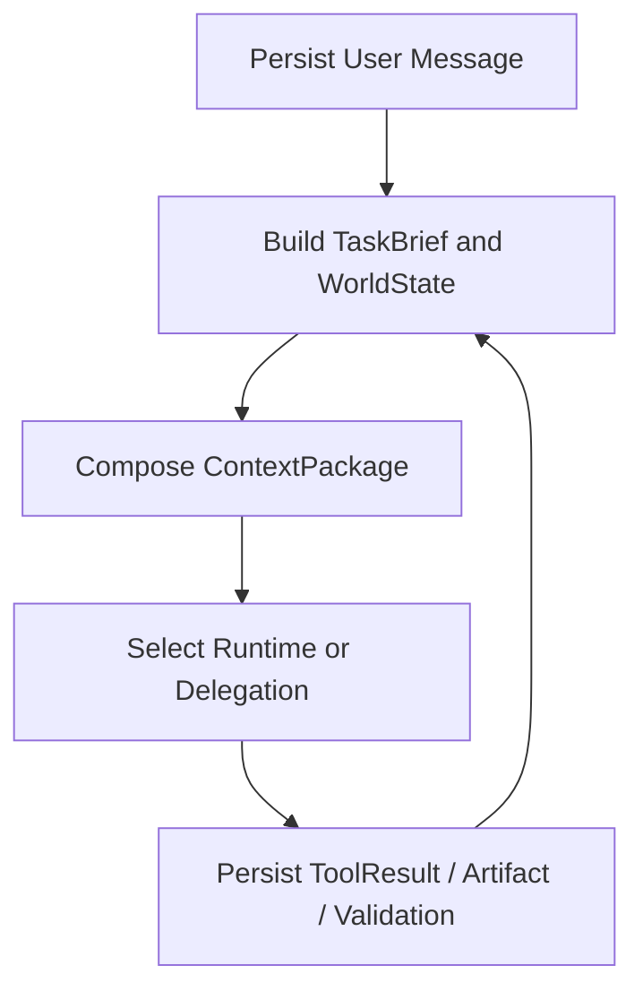

# ShanHai 垂类主智能体与上下文内核设计

- 设计版本：0.1.0
- Intake 编号：VA02
- 状态：`design_review`
- 模式：`planning_only`
- ShanHai 研究基线：`main@fd2521f1b558b36f2680a661f9d2eaf34ffa584e`
- 日期：2026-07-15

## 1. 正式定位

商业十二系统中的第三系统正式定位为：

```text
山海垂类主智能体与上下文内核
```

它不是一个包办所有生成工作的超级 Agent，而是一个面向教师项目的领域协调者。它负责理解任务、构造可信上下文、选择能力与 Runtime、委派专业任务、接收 Observation、处理人工决策并汇合结果。

建设策略：

```text
领域模型和决策权自有
+ Agent Loop / Event / Compaction / Runtime 机制复用
```

## 2. 从垂类项目得到的设计启发

### 2.1 DeepTutor

DeepTutor 将多种学习模式放在同一 Agent-native workspace 中，并强调上下文跨模式继承、分层记忆和证据可追溯。

ShanHai 吸收：

- 一个主智能体底座服务多个任务目标；
- 任务变化时切换 Context View，而不是复制整套项目；
- 记忆、结论和证据保持可追溯。

### 2.2 Claw-ED

Claw-ED 面向教师生成教案、课件与评估，并根据教师历史资料适配教学风格，通过教学检查反馈自动修订。

ShanHai 吸收：

- TeacherProfile 与历史作品风格；
- 教学质量检查和返修反馈；
- 教师评分与修改形成 FeedbackEvent。

ShanHai 不允许 Agent 根据一次编辑直接改写全局人格或生产 Skill。候选偏好必须经过作用域、置信度、隐私和版本治理。

### 2.3 Teaching-Agent

Teaching-Agent 采用规格先行、协调者与专业角色、学习者评审和共享项目状态。

ShanHai 吸收 Spec-first 和共享 WorldState，但共享状态必须是数据库投影，不是一个 Markdown 文件。

### 2.4 OpenMAIC 与 GPT Researcher

OpenMAIC 的 Outline -> Scene 适合构建课程、PPT 和视频之间的内容谱系；GPT Researcher 的 Planner/Researcher/Reviewer/Publisher 适合教材外研究和证据任务。

它们只作为任务模式，不成为所有教师对话的固定步骤。

## 3. 核心组件

### 3.1 Task Interpreter

将教师自然语言、附件和当前项目状态编译为结构化 `TaskBrief`：

```typescript
interface TaskBrief {
  taskId: string;
  projectId: string;
  intentEpoch: number;
  objective: string;
  expectedArtifacts: string[];
  audience: Record<string, unknown>;
  constraints: Record<string, unknown>[];
  acceptanceCriteria: Record<string, unknown>[];
  sourceArtifactRefs: ArtifactRef[];
  authorizationRef: string;
}
```

TaskBrief 必须由服务端绑定 projectId、intentEpoch 和授权引用；模型不能覆盖这些字段。

### 3.2 ProjectWorldState

向主智能体提供当前可信世界视图：

- 当前课程目标、学段、教材和课堂边界；
- 已确认教师决策；
- 活动 IntentGrant 与预算；
- 当前工作流节点；
- 最新有效 Artifact 版本；
- GenerationJob、Provider 和质量状态；
- 待处理问题与 HumanGate；
- 已批准记忆和证据引用。

WorldState 是从权威表构建的投影，不能成为第二数据库。

### 3.3 Context Orchestrator

每轮根据目标构建最小必要 `ContextPackage`：

```text
TaskBrief
+ ProjectWorldState 摘要
+ 当前节点和授权
+ 相关教材/Evidence 片段
+ 已批准 Artifact 版本
+ 相关 Teacher/Project Memory
+ 最近必要消息
+ Skill/Contract 摘要
+ AllowedTools、预算和 Guardrails
```

不同任务读取不同上下文视图：

- 教案：教材、课标、学情、教学目标；
- PPT：已确认教案、页面合同、视觉约束；
- 视频：课程锚点、已选创意主题、角色/视觉资产；
- 修改：目标 Artifact、修改要求和受影响上游约束；
- 研究：问题范围、Evidence Policy 和引用输出合同。

禁止默认把完整 Conversation Log、所有 Artifact 全文和全部工具 Schema 注入模型。

### 3.4 Main Agent Coordinator

主协调者只负责以下决策：

1. 教师当前任务是什么；
2. 当前状态是否足以执行；
3. 应加载哪个 Capability、Skill 或 Contract；
4. 应由 Native Runtime、Codex 或专项子智能体执行；
5. 是否需要 HumanGate；
6. Observation 到达后继续、返修、改路、暂停还是交付。

主协调者不亲自完成所有教案、PPT、视频和质量验证。

### 3.5 Runtime and Delegation Router

在 Turn/Node 开始前选择唯一执行后端：

```text
确定性校验或文件处理 -> Deterministic Worker
常规模型任务 -> Native/OpenAI Runtime
复杂受限多步任务 -> Codex Runtime
边界明确的专业任务 -> Specialized Subagent
Skill 声明的创意协作 -> Council Runtime
```

选择后，本 Turn/Node 不再让第二套 Agent Loop 同时规划工具。

### 3.6 Result Synthesizer

将 Runtime、子智能体和 Validator 的结果转化为教师可理解的状态，但不伪造业务完成：

- 引用真实 Artifact 和 ValidationReport；
- 标明失败、部分完成、待选择和待恢复；
- 隐藏 Provider、路径、Schema 等工程细节；
- 给出受业务状态支持的下一步。

## 4. 上下文分层

| 层级 | 内容 | 生命周期 |
| --- | --- | --- |
| Stable Policy | 身份、硬边界、工具协议、输出原则 | Runtime/版本级 |
| Project Context | 课程、教材、教师决策、有效 Artifact | 项目级 |
| Task Context | TaskBrief、Skill、Contract、预算和工具 | Turn/Node 级 |
| Working Context | 本轮计划、Tool Observation、临时推理 | Runtime 级 |
| Raw Evidence | 原始消息、ToolResult、文件、ValidationReport | 永久审计级 |

压缩只能改变 Working Context 和 Session Summary，不能覆盖 Raw Evidence、Project 事实、Artifact 或授权证明。

## 5. 会话、摘要和恢复

### 5.1 三类记录

- Conversation Log：完整原始对话，永久保留；
- Turn Snapshot：单次执行的结构化快照和事件索引；
- Project Summary：已确认事实、当前状态和开放问题的可重建摘要。

### 5.2 恢复顺序

1. 从 Project、TaskBrief、Checkpoint、ToolResult 和 Artifact 重建；
2. Runtime Thread 健康时继续；
3. Runtime Thread 不健康时创建新 Thread 并注入 ContextPackage；
4. 无法证明副作用是否完成时进入 `submission_unknown`，禁止自动重复付费调用。

## 6. 记忆与反馈边界

主智能体只读取经过系统10筛选的 MemoryPackage，不直接写长期记忆。

教师编辑、评分和采用结果形成：

```text
FeedbackEvent
  -> CandidatePreference
  -> Scope / Confidence / Privacy Review
  -> Approved TeacherProfile Version
```

单次项目风格不能自动升级为教师长期偏好；项目事实不能写入跨项目记忆；程序性 Skill 不能由一次对话自动修改并发布。

## 7. 主执行流



每次工具调用的顺序必须是：

```text
模型提出 Tool Intent
-> Policy / Authorization / Budget 校验
-> ToolRouter 执行
-> ToolResult 持久化
-> Observation 返回 Runtime
-> Main Agent 继续判断
```

## 8. 反模式

禁止：

- 一个超级 Prompt 承载任务、记忆、工具和质量规则；
- 主智能体直接写业务表或批准最终 Artifact；
- 子智能体继承完整聊天历史和全部工具；
- Runtime Session 代替 Project 状态；
- 每个教师请求默认启用多Agent；
- 让生成 Agent 同时担任最终质量裁判；
- 将 Context Summary 当作项目事实；
- 为接入 Codex、LangGraph 或 Agents SDK 新建第二业务控制面。

## 9. 验收方向

未来实施需以固定任务集比较旧新路径：

- TaskBrief 语义完整率；
- ContextPackage 相关性和 Token 消耗；
- 工具重复率与越权率；
- Artifact Contract 通过率；
- IntentEpoch 失效准确率；
- 中断与恢复成功率；
- 教师修改采纳率；
- Runtime 切换后的业务结果一致性；
- 未持久化 ToolResult 返回 Agent 的数量必须为 0。

## 10. 非目标

本设计不实现新的 Main Agent，不修改当前 Runtime，不创建 TeacherProfile 表，不引入向量数据库，不连接外部记忆服务，不改变当前 V1 主线。

