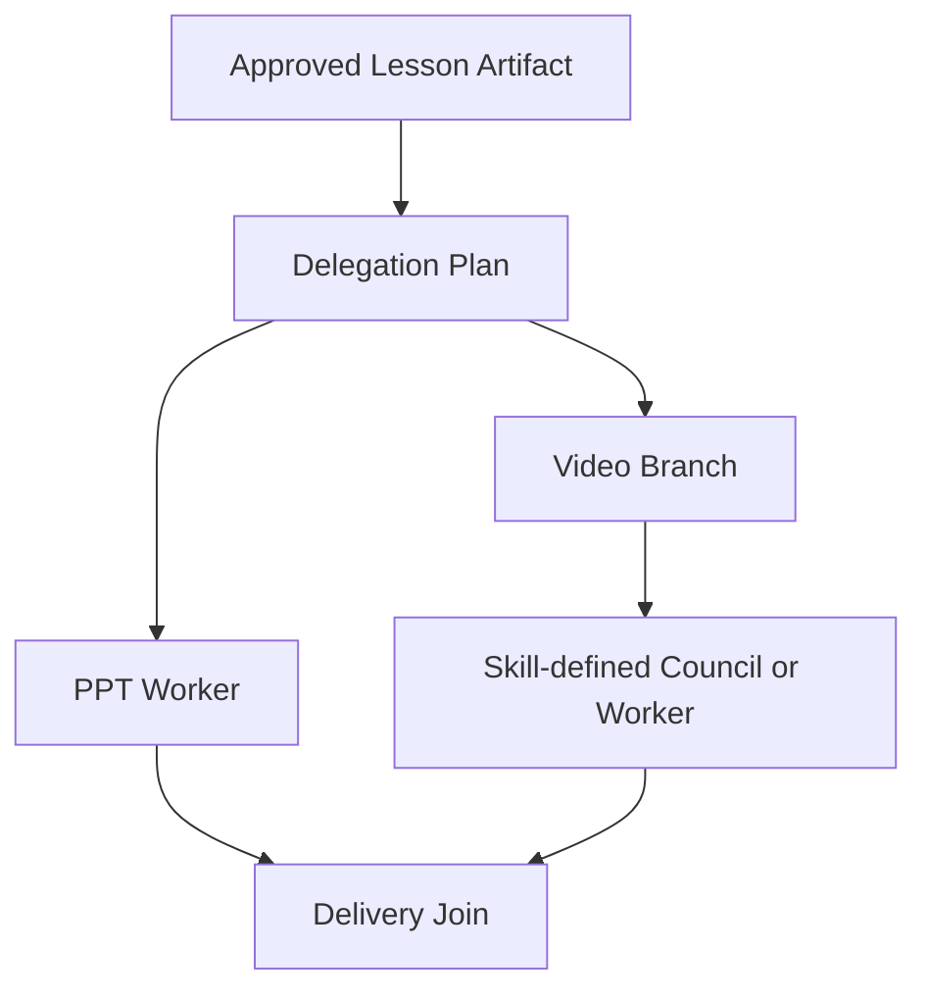

# Skill 驱动子智能体、并发生产与 Creative Council 设计

- 设计版本：0.1.0
- Intake 编号：VA03/VA04
- 状态：`design_review`
- 模式：`planning_only`
- ShanHai 研究基线：`main@fd2521f1b558b36f2680a661f9d2eaf34ffa584e`
- 日期：2026-07-15

## 1. 决策摘要

ShanHai 子智能体系统采用 A+B+C 组合：

- A：山海代码和业务状态机控制顶层任务图；
- B：主智能体调用边界明确的生产型子智能体；
- C：在需要高价值创意的局部节点中，由版本化 Skill 声明受控的多智能体 Council。

三者不是互斥方案，而是三个不同控制层级。

```text
业务任务依赖 -> A
专业成果生产 -> B
局部创意探索与评审 -> C
```

## 2. 权威开源设计启发

### 2.1 OpenAI Agents SDK

OpenAI Agents SDK 区分：

- Agents-as-tools：管理者调用专项 Agent，完成后管理者继续控制；
- Handoff：将当前会话控制权交给另一个 Agent；
- Code orchestration：通过代码并发运行彼此无依赖的 Agent。

ShanHai 的 PPT、视频和 Council 优先采用 Agents-as-tools 与代码编排，不将教师主对话 Handoff 给生产子智能体。

参考：<https://openai.github.io/openai-agents-python/multi_agent/>

### 2.2 Kimi Code

Kimi Code 的子智能体具有独立上下文，只收到主 Agent 的任务描述，后台运行后仅返回结论；状态保存在独立目录，并支持恢复。其子智能体默认不能继续嵌套派发。

ShanHai 吸收独立上下文、后台任务、结果回传、持久化和初期禁止嵌套。

参考：<https://moonshotai.github.io/kimi-code/en/customization/agents>

### 2.3 Claude Code

Claude Code 支持每个子Agent独立 Prompt、模型、工具、权限、MCP、Skill、Hook、记忆、前后台执行和恢复。

ShanHai 吸收 Agent Profile、工具范围、生命周期事件和可恢复 Run；不复制 Agent 任意写长期记忆和宿主工作区的个人使用假设。

参考：<https://code.claude.com/docs/en/sub-agents>

### 2.4 LangGraph 与 Microsoft Agent Patterns

LangGraph 提供 fan-out/fan-in、super-step、Checkpoint 和失败后保留成功分支写入的机制。Microsoft 将编排明确区分为 sequential、concurrent、handoff、group chat 和 magentic。

ShanHai 吸收这些执行模式的语义，但不要求所有模式由同一个框架实现。

参考：

- <https://docs.langchain.com/oss/javascript/langgraph/graph-api>
- <https://docs.langchain.com/oss/javascript/langgraph/checkpointers>
- <https://learn.microsoft.com/en-us/azure/architecture/ai-ml/guide/ai-agent-design-patterns>

## 3. 三种子智能体模式

| 模式 | 目的 | 控制方式 | 典型结果 |
| --- | --- | --- | --- |
| Worker | 完成边界明确的专业成果 | 主智能体委派，子Agent局部自主 | PPT设计包、视频剧本、研究报告 |
| Reviewer | 独立检查已有成果 | 只读输入，输出结构化评审 | ValidationReport、返修建议 |
| Council | 多Agent探索、批评、修订和汇合 | Skill 声明协作图，系统受控执行 | 创意主题集、候选方案与排名 |

Worker 和 Reviewer 可以是 Agent，也可以是确定性程序。能够用普通函数可靠完成的任务不强制包装成 Agent。

## 4. Skill 与架构的边界

### 4.1 Skill 负责

- 创意分类或方法论；
- 候选数量；
- 角色定义和角色数量；
- 哪些阶段并发、顺序、评审或修订；
- 讨论轮数和停止条件；
- 评分维度、权重和淘汰规则；
- 输出结构与 HumanGate 位置；
- 所需 Capability 和专业知识。

这些内容不得写死在 Main Agent、SubagentScheduler 或 Council Runtime 中。

例如“基于课程锚点生成三类九套创意视频主题”只是某个 `shanhai-video-<version>` Skill 的一种工作流声明，不是平台默认规则。

### 4.2 ShanHai 控制面负责

- Skill 发现、版本锁定、摘要加载和完整加载；
- Skill 完整性、发布状态和 digest 校验；
- 将 Skill 声明编译成可执行 CouncilPlan；
- 最大并发、最大深度、最大轮数、超时和预算；
- Runtime、模型和 Provider 选择；
- 工具白名单与 ExecutionEnvelope；
- Task/Run/Event/Result 持久化；
- 中断、恢复、取消、重试和陈旧结果隔离；
- Artifact、Validation、计费和审计。

Skill 不能通过声明扩大当前用户授权、突破预算或直接调用未注册工具。最终工具范围是：

```text
SkillRequestedTools
∩ AgentProfileAllowedTools
∩ IntentGrantAllowedTools
∩ RuntimeAvailableTools
∩ PolicyAllowedTools
```

## 5. 通用协作原语

Council Runtime 只提供通用原语：

- `spawn`：创建一个或多个子智能体；
- `parallel`：并发执行无依赖任务；
- `sequence`：按依赖顺序交接；
- `review`：对候选成果执行独立评审；
- `revise`：基于评审意见执行有界修订；
- `select`：排序、筛选、投票或组合；
- `join`：等待所需分支汇合；
- `interrupt`：暂停并等待教师或外部条件；
- `resume`：从持久化检查点继续；
- `cancel`：取消失效或越界分支。

平台不内置特定创意方向、候选数量或固定评审角色。

## 6. Skill 编译后的执行合同

```typescript
interface CouncilPlan {
  planId: string;
  projectId: string;
  intentEpoch: number;
  skillRef: {
    name: string;
    version: string;
    digest: string;
  };
  objective: string;
  sourceArtifactRefs: ArtifactRef[];
  roles: CouncilRole[];
  stages: CouncilStage[];
  outputContract: Record<string, unknown>;
  humanGates: HumanGateSpec[];
}

interface CouncilStage {
  stageId: string;
  operation:
    | "spawn"
    | "parallel"
    | "sequence"
    | "review"
    | "revise"
    | "select"
    | "join"
    | "interrupt";
  roleRefs: string[];
  inputRefs: string[];
  outputSchemaRef: string;
  dependsOn: string[];
}
```

模型或 Skill 提供的是候选计划；服务端必须重新绑定 projectId、intentEpoch、预算、权限和截止时间后才能执行。

## 7. 生产型子智能体委派合同

```typescript
interface DelegatedTaskBrief {
  taskId: string;
  parentTurnId: string;
  projectId: string;
  intentEpoch: number;
  objective: string;
  sourceArtifactRefs: ArtifactRef[];
  contextPackageRef: string;
  skillRef?: SkillRef;
  allowedTools: string[];
  outputContract: Record<string, unknown>;
  acceptanceCriteria: Record<string, unknown>[];
  budget: RuntimeBudget;
  deadlineAt: string;
}
```

子智能体只返回：

- 候选 Artifact 引用；
- ToolResult/Observation 引用；
- ValidationReport；
- Usage 和 Cost；
- `needs_input`、`retryable_failure` 或完成状态；
- 对下一步的非权威建议。

子智能体不能直接更新 Project、IntentEpoch、HumanGate、QualityDecision 或 Artifact Promotion。

## 8. PPT 与视频并发示例

当共同上游教案和必要共享约束已经确认后，可以形成：



该图只表达依赖关系，不固定视频分支内部的创意分类、候选数量、角色或讨论轮数。

并发成立的前提：

1. 两个分支读取同一不可变上游 Artifact 版本；
2. 两个分支写入不同 Artifact 命名空间；
3. 所需共享视觉或角色资产已冻结，或者由 Skill 显式声明依赖；
4. Provider 配额和预算已预留；
5. 任一分支失败不会使另一成功结果失去业务语义；
6. 汇合节点能够独立判断 required、optional 或 best-effort 分支。

如果视频必须复用 PPT 页面图像，则 Skill/任务图必须声明依赖，不能为了并发而破坏一致性。

## 9. 生命周期与状态

每个子任务至少具有：

```text
planned
-> queued
-> running
-> waiting_external | waiting_human
-> validating
-> succeeded | failed | cancelled | stale
```

必须持久化：

- parentRunId、taskId、agentProfile、runtimeKind；
- skill name/version/digest；
- source Artifact ID/version/hash；
- IntentEpoch 和授权引用；
- lease、fence、heartbeat、attempt；
- Token、Provider 成本和业务积分；
- ToolCall、ToolResult、Observation 和 Validation；
- 最终状态和失败分类。

## 10. 中断、恢复和陈旧结果

### 10.1 教师修改上游输入

教师修改教案或任务范围后提升 IntentEpoch。旧子任务：

- 可安全取消则取消；
- 已完成结果标记为 `stale`；
- 不进入最终汇合和交付；
- 根据影响分析决定局部重用或重建。

### 10.2 单分支失败

视频失败不重新运行已成功的 PPT；PPT失败不丢弃有效视频候选。汇合节点等待 required 分支，并从最后安全检查点恢复失败分支。

### 10.3 Provider 提交不确定

当请求已经发出但无法确认 Provider 是否受理，进入 `submission_unknown`。先对账，不自动重提，避免重复扣费。

## 11. 长时媒体任务

子智能体不应持续占用模型等待图片、语音或视频 Provider。

正确模式：

```text
子Agent规划并提交受控 Job
-> Worker 调用 Provider
-> 子Agent Run 进入 waiting_external
-> 回调/轮询结果持久化
-> 事件唤醒原 Run
-> 子Agent或 Validator 继续检查
```

Agent 负责规划和判断，Worker 负责长时 I/O 与媒体处理。

## 12. 安全与成本规则

1. 第一阶段最大嵌套深度为 1；子Agent不能创建孙Agent。
2. 主智能体是唯一教师对话入口；子Agent需要信息时返回 `needs_input`。
3. 子Agent默认不继承完整主对话，只读取 ContextPackage。
4. 每个任务必须有超时、心跳、取消、幂等键和预算。
5. Tool 权限按交集计算，不做隐式继承。
6. 每个分支独立记录 Token、Provider 成本和积分。
7. Council 必须有最大角色数、最大阶段数和最大修订轮数。
8. 生成 Agent 不能担任最终业务 Validator。
9. 失败文本必须分类并安全摘要，不能把内部错误直接展示给教师。
10. 完成的含义是结构化结果已持久化，不是子Agent输出“完成”。

## 13. 分阶段路线

### VA03-0：合同设计

只完成 AgentProfile、DelegatedTaskBrief、SubagentRun、Event 和 Result 合同设计。

### VA03-1：单一受限 Worker

只支持一个边界明确、无付费媒体副作用的子智能体，深度固定为 1。

### VA03-2：固定 fan-out/fan-in

支持两个独立分支、持久化任务、单分支恢复和汇合，不开放动态 Council。

### VA04-0：Skill -> CouncilPlan 编译

验证 Skill 版本、digest、角色、阶段、依赖和输出合同，不执行生产任务。

### VA04-1：受限 Council PoC

只在离线固定课程数据上验证动态角色、并发、评审和汇合；不调用真实媒体 Provider。

### VA04-2：教师可见候选与 HumanGate

Council 输出候选 Artifact，由教师选择或按 Skill 规则继续；未经确认不进入高成本生产。

### VA04-3：受控商用灰度

在成本、质量、延迟和采纳率不低于单Agent基线后，才按项目开关灰度。

## 14. 验收方向

- 父子任务谱系完整率 100%；
- 未持久化 Result 返回父Agent数量 0；
- IntentEpoch 失效结果进入交付数量 0；
- 失败恢复重复付费调用数量 0；
- 子Agent越权工具调用数量 0；
- 超时后僵尸任务数量 0；
- 成功分支因另一分支失败而无必要重跑数量 0；
- Skill 变更后旧 Run 无法证明版本的数量 0；
- Council 相对单Agent的质量、创意多样性、采纳率、成本和延迟有固定评测数据。

## 15. 明确非目标

本设计不固化任何视频创意类型、数量和角色；不安装多Agent框架；不启用生产并发；不修改现有 Skill；不创建真实媒体任务；不改变当前 Main Agent 和 V1 工作流。

