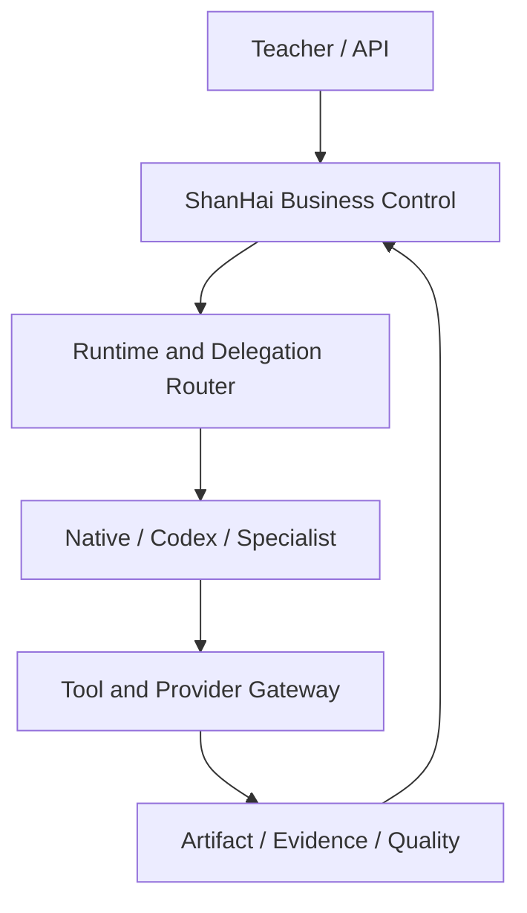

# ShanHai 垂类智能体总体架构与开源吸收设计

- 设计版本：0.1.0
- 状态：`design_review`
- 分支：`intake-vertical-agent`
- 模式：`planning_only`
- ShanHai 研究基线：`main@fd2521f1b558b36f2680a661f9d2eaf34ffa584e`
- 日期：2026-07-15

## 1. 决策摘要

ShanHaiEdu-Studio 的目标不是成为通用聊天 Agent，也不是把若干模型 API 直接拼成一条固定流水线，而是成为以教师项目为中心的教育内容生产系统。

最终路线确定为：

```text
ShanHai 领域内核
  + 开源基础设施
  + 可插拔 Agent Runtime
  + Skill 驱动业务方法
  + Artifact / Evidence / Quality Gate 事实体系
```

需要自有的不是每一行基础设施代码，而是以下不可外包的业务控制权：

- 教师任务语义和授权；
- ProjectWorldState 与 IntentEpoch；
- 教案、PPT、图片、视频和交付包的 Artifact 谱系；
- 教育质量、证据边界和完成标准；
- Provider 成本、积分、预算和利润台账；
- 失败恢复、人工决策和审计证据。

模型、Runtime、MCP、队列、观测、文档解析和媒体工具均可通过 Adapter 复用或替换。

## 2. 研究基线与当前问题

当前 ShanHai 已具备 Main Agent Controlled ReAct、ToolRegistry、ToolRouter、ExecutionEnvelope、IntentEpoch、Checkpoint、Artifact、Quality Gate 和 SQLite 持久化等基础。

当前问题集中在系统边界和真实产品行为，而不是“缺一个更大的框架”：

| 当前问题 | 架构根因 | 目标修正 |
| --- | --- | --- |
| `inputDraft` 在内部 Tool 边界丢失 | Task 语义没有形成不可变执行合同 | 引入 TaskBrief / RunInputSnapshot / ContextPackage |
| 22 个 Capability 全部逐 Tool 确认 | 授权、执行确认、产物确认混为一体 | IntentGrant + ActionPolicy + 风险升级 HumanGate |
| Business Tool 不能连续进入 ReAct | Agent Loop 与业务推进路径割裂 | 一个 Turn/Node 单一 Loop 所有者，Observation 回流 |
| Tool 成功后强制回到确认 | 完成判断依赖旧固定路径 | Main Agent 依据状态和合同自主继续或停止 |
| 多个产物仍是 deterministic draft | Runtime 成功与真实 Artifact 成功混淆 | Artifact Truth Gate 和真实文件探针 |
| 带 Tool 的真实 Provider 通道不稳定 | Provider 协议与业务语义没有充分隔离 | Runtime Adapter、响应归一化、失败分类 |
| SQLite 多客户端写入受限 | 本地单实例拓扑无法直接扩展商用 | Postgres、队列、租约和幂等演进路线 |
| 视频技术通过但创意锚点失败 | 技术校验不能代替教育创意质量 | Skill 驱动 Creative Council + 独立 Validator |
| 旧新控制路径并存 | 文档、状态和实现存在多事实源 | 单一业务控制面与 Architecture Drift Review |

## 3. 五平面目标架构

五平面是职责分区，不强制等同于五个部署服务。

### 3.1 体验平面 Experience Plane

负责教师工作台、主对话、计划、进度、Artifact 阅读、修改、确认和下载。

可复用：

- `assistant-ui` 等对话组件；
- AG-UI 兼容事件层；
- SSE/WebSocket 流式状态；
- 低噪声工作台和可恢复任务卡片。

不得负责：业务状态推进、Provider 调用、成本计算和完成判定。

### 3.2 智能体控制平面 Agent Control Plane

负责 TaskBrief、ProjectWorldState、上下文编排、Capability/Skill 选择、DelegationPlan、PlanGuard、HumanGate、Runtime 选择和结果汇合。

ShanHai 必须保留该平面的领域决策权。LangGraph、OpenAI Agents SDK、Codex 或其他框架只能作为局部执行机制，不能成为业务事实源。

### 3.3 执行运行平面 Runtime Plane

负责模型调用、Agent Loop、子智能体执行、MCP/Tool 调用、Provider Adapter、异步 Worker、文件生成和媒体合成。

可选执行后端包括：

- 当前 Native Controlled Runtime；
- OpenAI-compatible Runtime；
- Codex App Server Runtime；
- OpenAI Agents SDK Adapter；
- 独立 Python 专项服务；
- 确定性 Worker。

同一 Turn/Node 只允许一个主 Agent Loop。

### 3.4 数据、记忆与知识平面 Data & Memory Plane

负责 Project、Conversation Log、Artifact、Evidence、GenerationJob、Checkpoint、Runtime Thread 映射、TeacherProfile、Project Memory、Session Summary、Skill 版本和成本记录。

业务真相以数据库和对象存储为准。Redis、Runtime Session、向量库、模型上下文和摘要都不是权威事实源。

### 3.5 质量、治理与观测平面 Quality & Governance Plane

负责 Schema、领域 Validator、真实文件探针、课程锚点、版权与隐私、质量门、审计、成本观测、轨迹回放和最终交付。

生成者不能成为自己的最终裁判。模型自称完成不能直接推进 Artifact Promotion。

## 4. 面向商用的十二系统

| 编号 | 系统 | 主要平面 | 建设策略 |
| --- | --- | --- | --- |
| 1 | 工作台体验与人机协作 | 体验 | 复用 UI/事件组件，山海定义教师任务体验 |
| 2 | 租户、身份与项目 | 数据/治理 | ShanHai 自有，后续从项目成员演进到多租户 |
| 3 | 垂类主智能体与上下文内核 | 控制 | 领域状态和决策权自有，Runtime 机制可复用 |
| 4 | Capability、Skill 与节点合同 | 控制/治理 | 版本化注册，业务方法通过 Skill 按需加载 |
| 5 | Workflow、Intent 授权与人工决策 | 控制/治理 | ShanHai 自有，固定事实与动态 Agent 判断分离 |
| 6 | Agent Runtime 与子智能体 | 运行 | Adapter 化，支持 Worker、Reviewer、Council |
| 7 | Tool、MCP 与 Provider Gateway | 运行/治理 | ToolRouter 唯一入口，MCP 只做协议投影 |
| 8 | 异步任务、Worker 与媒体生产 | 运行/数据 | 本地执行器起步，商用演进到队列和独立 Worker |
| 9 | Artifact、资产与交付 | 数据/质量 | ShanHai 自有，真实文件、版本和谱系是核心资产 |
| 10 | 记忆、知识与证据 | 数据/治理 | 分层记忆、教材边界、引用和可审计反馈学习 |
| 11 | 计费、额度与成本台账 | 数据/治理 | Provider 成本、积分和利润统一核算 |
| 12 | 质量、政策、安全、审计与观测 | 质量/治理 | 独立 Validator、策略门禁、轨迹与指标 |

## 5. 开源项目吸收矩阵

### 5.1 垂类教育智能体

| 项目 | 值得吸收 | 不直接照搬 |
| --- | --- | --- |
| [DeepTutor](https://github.com/HKUDS/DeepTutor) | 一个 Runtime 支撑多种学习目标、跨模式上下文、多层可解释记忆和证据链 | 偏学习者、体量巨大且仍在快速演进，不替换 ShanHai 教师生产内核 |
| [Claw-ED](https://github.com/SirhanMacx/Claw-ED) | 教师历史风格、教学质量检查、作品包生成、编辑反馈 | 本地个人 Agent 假设和自动修改长期人格文件不适合商用多租户 |
| [LiaScript Teaching-Agent](https://github.com/LiaScript/teaching-agent) | Spec-first、协调者与专家角色、学习者视角评审、共享项目状态 | `journal.md` 不能作为商业系统业务真相 |
| [OpenMAIC](https://github.com/THU-MAIC/OpenMAIC) | Outline 到 Scene 的两阶段内容模型和异步生成 | 不复制逐步确认和固定流程 |
| [AI Lesson Planner](https://github.com/saniales/ai-lesson-planner) | 专家角色的严格输入输出边界 | 不把角色固化成所有任务都必须执行的串行链 |
| [Open TutorAI CE](https://github.com/Open-TutorAi/open-tutor-ai-CE) | Gateway、Domain Service、Repository、AI Provider Adapter 分层 | 它不是教师内容生产的完整主智能体内核 |

### 5.2 通用与编程智能体

| 项目 | 值得吸收 | 山海约束 |
| --- | --- | --- |
| [Hermes Agent](https://github.com/NousResearch/hermes-agent) | Runtime 切换、记忆、压缩、事件、中断与恢复 | 详细机制由 `intake-hermes` 单独研究 |
| [Kimi Code](https://moonshotai.github.io/kimi-code/en/customization/agents) | 主/子智能体、独立上下文、后台执行、恢复和持久化 | 子Agent不直接接触教师，不共享可变业务状态 |
| [Claude Code Subagents](https://code.claude.com/docs/en/sub-agents) | 专属 Prompt、工具、权限、MCP、Skill、Hook、恢复和隔离 | 商用记忆不能由 Agent 任意写入，必须走治理流程 |
| [OpenAI Agents SDK](https://openai.github.io/openai-agents-python/multi_agent/) | Agents-as-tools、Handoff、代码控制并发、结构化输出和 Guardrail | PPT/视频优先使用管理者调用，而不是把主对话 Handoff 出去 |
| [OpenCode](https://opencode.ai/docs/agents/) | Primary/Subagent、父子 Session、模型和权限配置 | 必须补足超时、取消、权限继承、递归深度和成本聚合 |
| [OpenHands Agent Server](https://docs.openhands.dev/sdk/guides/agent-server/overview) | Agent Server、事件流、运行环境隔离 | 不复制代码 Agent 的任意 Shell/Workspace 权限 |
| [GPT Researcher](https://github.com/assafelovic/gpt-researcher) | Planner/Researcher/Reviewer/Publisher 与证据优先 | 不为所有教师任务默认启用昂贵多Agent研究 |

### 5.3 基础设施候选

| 能力 | 候选开源组件 | ShanHai 定位 |
| --- | --- | --- |
| 模型与供应商路由 | LiteLLM | 统一协议、限流和 Provider 路由，不持有业务完成状态 |
| 任务队列 | Redis + BullMQ | 任务分发、重试、延迟和并发控制，数据库仍是权威状态 |
| 关系数据库 | PostgreSQL | 商用多租户、事务、租约和并发写入 |
| 对象存储 | S3/MinIO 兼容存储 | Artifact 二进制、版本和签名访问 |
| 文档解析 | MinerU 等 | 教材结构化输入，通过 Adapter 和 Evidence Contract 接入 |
| 观测 | OpenTelemetry、Langfuse | Trace、成本、延迟和轨迹；不成为业务真相 |
| 评测 | Promptfoo 等 | 固定数据集、回归和对比评测 |
| 媒体处理 | FFmpeg | 确定性合成、探针和格式校验 |

## 6. 总体运行关系



业务控制面负责“做什么、允许什么、什么算通过”；Runtime 负责“在受限任务内怎么做”；Gateway 负责“真实执行并持久化”；Quality 负责“是否合格”。

## 7. 核心不变量

1. Project 是中心对象，聊天只是交互入口。
2. Agent 是调度者，不是业务事实源。
3. Skill 是可版本化业务方法，不是绕过控制面的脚本权限。
4. ContextPackage 是模型输入边界，不等于完整 Conversation Log。
5. ToolRouter/Gateway 是业务工具唯一执行入口。
6. ToolResult 先持久化，Observation 后返回。
7. Artifact、Evidence 与 Validator 决定真实完成。
8. Runtime Thread、Redis、向量库、摘要和 Langfuse 都不是业务真相。
9. 同一个 Turn/Node 只有一个主 Agent Loop。
10. 付费 Provider 调用必须有预算预留、幂等键和结果对账。
11. 子智能体只能提交候选结果和建议，不能批准 HumanGate、QualityDecision 或 Artifact Promotion。
12. 创意 Council 的结构由 Skill 声明，系统不硬编码分类、数量或角色。

## 8. 推荐演进顺序

本设计不要求一次实现十二系统。建议未来按依赖关系推进：

1. 先稳定 TaskBrief、IntentGrant、ContextPackage、ToolResult/Observation 和 Artifact Truth。
2. 再统一 Runtime Event、Turn 生命周期、中断、恢复和成本统计。
3. 然后实现深度为 1 的受限生产型子智能体。
4. 再实现 Skill 编译到 CouncilPlan 的通用协作运行时。
5. 最后才开放动态角色、复杂多Agent创意讨论和分布式 Worker。

任何阶段都必须保留 Native Runtime 对照组和安全回退路径。

## 9. 非目标

本 Intake 不做：

- 不替换当前 Main Agent；
- 不安装 LangGraph、Agents SDK 或其他框架；
- 不启动 Codex App Server；
- 不修改五平面和十二系统现有权威文档；
- 不修改生产代码、数据库或 Prompt；
- 不启用 PPT/视频并发生产；
- 不固化任何创意分类、候选数量或 Council 角色；
- 不创建合入 `main` 的 PR。

## 10. 结论

ShanHai 的竞争力不应建立在“自己写了一个通用 Agent Loop”，而应建立在教育领域状态、教师任务理解、Skill 方法库、Artifact 谱系、教育证据、质量门和商业治理上。

开源项目用于提供已经被验证的运行机制；ShanHai 负责把这些机制拼成一个能够真实交付教案、PPT、视频和课程材料包的垂类生产系统。

